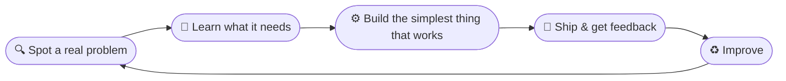

<!-- ═══════════════ HEADER ═══════════════ -->
<div align="center">


<a href="https://github.com/dharanishvijayakumar7-lgtm">
  
</a>

<br/>


<a href="https://linkedin.com/in/dharanish-vijayakumar-a9b112392">
  
</a>
<a href="https://github.com/dharanishvijayakumar7-lgtm?tab=followers">
  
</a>

</div>

<br/>

<!-- ═══════════════ TERMINAL ABOUT ═══════════════ -->
## 🖥️ `whoami`

```bash
dharanish@github:~$ whoami
Dharanish Vijayakumar

dharanish@github:~$ cat about.json
{
  "role"     : "CSE Student & Builder",
  "focus"    : ["AI / ML", "Computer Vision", "Full-Stack Development"],
  "building" : ["Tools for farmers", "Women-safety tech", "Carbon-footprint AI"],
  "style"    : "Impact over complexity",
  "motto"    : "Code. Learn. Build. Repeat. 🚀"
}

dharanish@github:~$ echo $STATUS
🎯 Focusing  |  🏆 Hackathon mode: ON
```

<br/>

<!-- ═══════════════ BUILD LOOP ═══════════════ -->
## 🔁 How I Build



<br/>

<!-- ═══════════════ TECH ═══════════════ -->
## 🧰 Tech Arsenal

<div align="center">

**Languages**<br/>


**Frameworks & Backend**<br/>


**Data & Storage**<br/>


**Dashboards & ML**<br/>


**Tools**<br/>


</div>

<br/>

<!-- ═══════════════ PROJECTS ═══════════════ -->
## 🚀 Featured Projects

<table>
<tr>
<td width="50%" valign="top">

<a href="https://github.com/dharanishvijayakumar7-lgtm/cropPilot">
  
</a>

**🌾 CropPilot** — a multilingual, voice-enabled farming assistant for Indian farmers: hyperlocal weather-risk maps, a 5-day farming forecast, and a disaster-scheme navigator in 6 languages.
<br/>`Flask` `SQLite` `Leaflet.js` `OpenWeather` `Web Speech API`
<br/>🔗 [Live demo](https://croppilot.onrender.com) · 🏆 *AgroTech Hackathon 2026*

</td>
<td width="50%" valign="top">

<a href="https://github.com/dharanishvijayakumar7-lgtm/SAFEHER-women-safety-alert-system">
  
</a>

**🚺 SAFEHER** — a mobile safety companion with one-tap SOS, live GPS location sharing and instant alerts to trusted contacts.
<br/>`Flutter` `Firebase` `GPS` `Android`

</td>
</tr>
<tr>
<td width="50%" valign="top">

<a href="https://github.com/dharanishvijayakumar7-lgtm/carbonintelligence">
  
</a>

**🌍 Carbon Intelligence** — an AI-driven carbon-footprint tracker for organizations with zero budget: ingests bills, estimates emissions, forecasts trends and answers questions through a chatbot.
<br/>`FastAPI` `DuckDB` `Streamlit` `LangChain` `scikit-learn`

</td>
<td width="50%" valign="top">

<a href="https://github.com/dharanishvijayakumar7-lgtm/UPI_transaction_fruad_detection">
  
</a>

**💳 UPI Fraud Detection** — overnight-hackathon project exploring how to flag suspicious UPI transactions with Python.
<br/>`Python` `Data Analysis`

</td>
</tr>
</table>

<details>
<summary>🔧 <b>More experiments</b></summary>
<br/>

- 🚗 **[CameraCar](https://github.com/dharanishvijayakumar7-lgtm/CameraCar)** — ESP32 camera car (C++), a hands-on dive into embedded hardware.

</details>

<br/>

<!-- ═══════════════ STATS ═══════════════ -->
## 📊 GitHub Stats

<div align="center">


</div>

<br/>

<!-- ═══════════════ NOW ═══════════════ -->
## 🌱 Right Now

| 🔭 Exploring | 🛠️ Building | 🤝 Open to |
| :--- | :--- | :--- |
| AI/ML & computer vision | Apps that solve everyday problems | Hackathons, teams & collaborations |

<br/>

<!-- ═══════════════ CONNECT ═══════════════ -->
## 📫 Let's Connect

<div align="center">

<a href="https://linkedin.com/in/dharanish-vijayakumar-a9b112392"></a>
<a href="https://github.com/dharanishvijayakumar7-lgtm"></a>
<a href="https://croppilot.onrender.com"></a>

<br/><br/>

<i>"We didn't chase buzzwords. We built what people actually need."</i>


</div>
